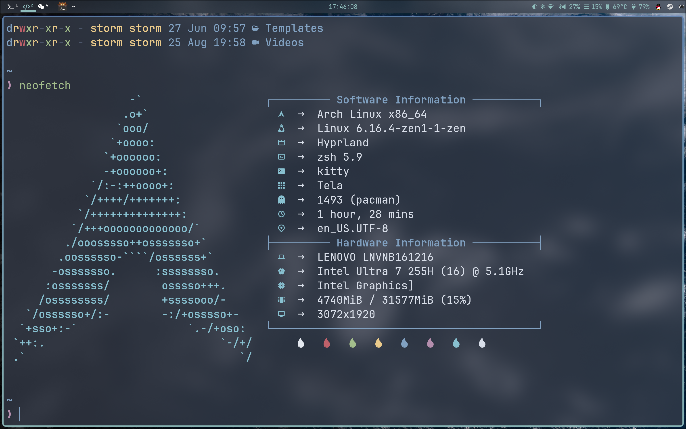

## storm-1614's Dotfiles 

This repository is store my config files. I have been using ArchLinux for over three years.  

There no only have .config, but also have various source config files. Beside, I use rsync to sync my config files.  

## usage
- 🪟 Windows Manager: Hyprland  
- 🍡 Bar: Waybar  
- ✍️ Editor: Neovim  
- 🗃️ File Manager: Yazi  

Have good rices!  
