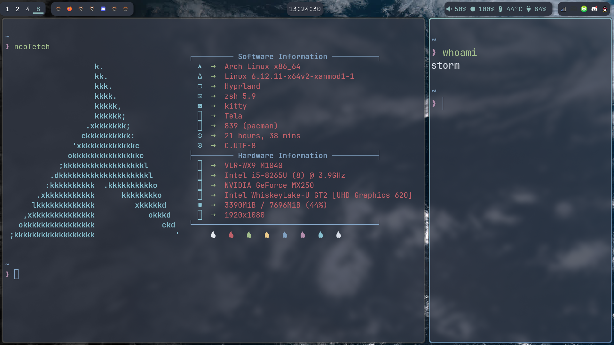

## Dotfiles 

This is my dotfiles, We have many dotfiles, such as dwm, bspwm, and hyprland.  
Now I am use hyprland with Archlinux. This is My screenshot:

Because I am a Senior high school student, I don't have enough time to update my dotfile,So There have some program have failure, such as font didn't correctly display.When next summer vacation comes, I will repair failure,thanks.  

这里是存储我自己的 Dot,里面包含了可用的 bspwm 和 dwm 。  
目前我正在使用 bspwm  

bsowm 包含了bspwm, sxhkd, polybar, wallpapers 四个主要部件。  
壁纸采用的是一个定时更新的卫星云图可以到[这里获取](https://github.com/storm-1614/satellite/)  

